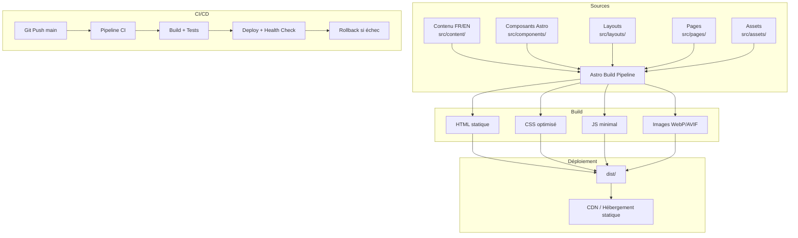
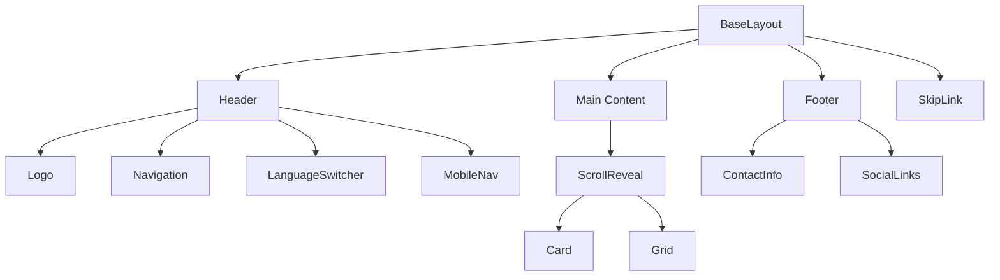

# Document de Conception Technique

## Vue d'ensemble

Ce document décrit l'architecture technique et les choix de conception pour la refonte du site web AS Grézieu Tennis. Le site actuel hébergé sur Wix sera reconstruit avec le framework Astro, un générateur de sites statiques moderne qui livre zéro JavaScript par défaut grâce à son architecture en îlots (Islands Architecture).

### Principes directeurs

- **Performance d'abord** : Astro génère du HTML statique pur, le JavaScript n'est chargé que pour les composants interactifs
- **Accessibilité native** : Conformité WCAG 2.1 AA intégrée dès la conception
- **Bilingue par défaut** : Routage i18n natif d'Astro avec préfixes d'URL `/fr/` et `/en/`
- **Animations sobres** : CSS-first avec IntersectionObserver pour les apparitions au défilement
- **Déploiement fiable** : Pipeline CI/CD avec versionnement sémantique et rollback

### Résumé des recherches

- **Astro i18n** : Depuis la v4.0, Astro intègre un routage i18n natif avec configuration des locales, génération d'URL préfixées, et helpers pour la navigation multilingue ([docs.astro.build](https://docs.astro.build/en/guides/internationalization))
- **Optimisation d'images** : Le composant `<Picture />` d'Astro génère automatiquement des sources WebP/AVIF avec fallback, et supporte le lazy loading natif ([docs.astro.build](https://docs.astro.build/guides/images/))
- **View Transitions** : Astro propose une API de transitions entre pages pour des navigations fluides sans SPA ([docs.astro.build](https://docs.astro.build/en/guides/view-transitions/))
- **Architecture Islands** : Hydratation partielle permettant d'isoler les composants interactifs (sélecteur de langue, menu mobile) du contenu statique

---

## Architecture

### Architecture globale



### Architecture en couches

| Couche | Responsabilité | Technologies |
|--------|---------------|--------------|
| Contenu | Textes bilingues, médias | JSON/Markdown, images optimisées |
| Présentation | Composants UI, layouts | Astro Components, CSS |
| Animation | Effets visuels subtils | CSS Transitions, IntersectionObserver |
| i18n | Routage et traductions | Astro i18n natif, fichiers JSON |
| Build | Compilation et optimisation | Astro CLI, Sharp (images) |
| Déploiement | Mise en production | GitHub Actions, versionnement sémantique |

### Structure du projet

```
asgrezieu-tennis/
├── astro.config.mjs          # Configuration Astro (i18n, images, integrations)
├── package.json
├── tsconfig.json
├── public/                    # Assets statiques non transformés
│   ├── favicon.svg
│   └── robots.txt
├── src/
│   ├── assets/
│   │   ├── images/            # Images source (optimisées au build)
│   │   └── fonts/             # Polices personnalisées
│   ├── components/
│   │   ├── common/            # Header, Footer, Navigation, SkipLink
│   │   ├── ui/               # Card, Button, Grid, LanguageSwitcher
│   │   └── animations/       # ScrollReveal, TransitionWrapper
│   ├── content/
│   │   └── extracted-content.json  # Contenu extrait du site Wix
│   ├── i18n/
│   │   ├── fr.json            # Traductions françaises
│   │   ├── en.json            # Traductions anglaises
│   │   └── utils.ts           # Helpers i18n (getTranslation, getLocalePath)
│   ├── layouts/
│   │   └── BaseLayout.astro   # Layout principal (head, header, footer)
│   ├── pages/
│   │   ├── fr/                # Pages françaises (défaut)
│   │   │   ├── index.astro
│   │   │   ├── le-club.astro
│   │   │   ├── activites.astro
│   │   │   ├── reservation.astro
│   │   │   └── contact.astro
│   │   └── en/                # Pages anglaises
│   │       ├── index.astro
│   │       ├── the-club.astro
│   │       ├── activities.astro
│   │       ├── booking.astro
│   │       └── contact.astro
│   └── styles/
│       ├── global.css         # Variables CSS, reset, typographie
│       ├── animations.css     # Définitions d'animations
│       └── responsive.css     # Media queries et breakpoints
├── docs/
│   └── charte-graphique.md    # Documentation charte graphique extraite
├── scripts/
│   └── extract-content.ts     # Script d'extraction du site Wix
└── .github/
    └── workflows/
        └── deploy.yml         # Pipeline CI/CD
```

---

## Composants et Interfaces

### Composants principaux

#### BaseLayout.astro

Layout racine appliqué à toutes les pages. Gère le `<head>` (meta, hreflang, lang), le header, le footer, et le skip link.

```typescript
// Props du BaseLayout
interface BaseLayoutProps {
  title: string;
  description: string;
  locale: 'fr' | 'en';
  alternateLocales: { locale: string; href: string }[];
}
```

#### Header.astro

En-tête avec logo, navigation principale, et sélecteur de langue. Responsive avec menu hamburger sous 768px.

```typescript
interface HeaderProps {
  locale: 'fr' | 'en';
  currentPath: string;
}
```

#### LanguageSwitcher.astro

Composant interactif (island) permettant le changement de langue. Accessible au clavier et aux lecteurs d'écran.

```typescript
interface LanguageSwitcherProps {
  currentLocale: 'fr' | 'en';
  currentPath: string; // Chemin sans préfixe de locale
}
```

#### ScrollReveal.astro

Composant wrapper pour les animations d'apparition au défilement. Utilise IntersectionObserver avec un seuil de 20%.

```typescript
interface ScrollRevealProps {
  animation?: 'fade-in' | 'slide-up' | 'slide-left' | 'slide-right';
  duration?: number; // 150-500ms, défaut 300ms
  delay?: number;    // Délai optionnel en ms
}
```

#### MobileNav.astro

Menu de navigation rétractable pour les écrans < 768px. Island hydraté côté client pour l'interactivité.

```typescript
interface MobileNavProps {
  locale: 'fr' | 'en';
  links: { label: string; href: string }[];
}
```

### Diagramme des composants



### Module i18n

```typescript
// src/i18n/utils.ts

type Locale = 'fr' | 'en';

interface TranslationMap {
  [key: string]: string | TranslationMap;
}

/**
 * Récupère une traduction par clé et locale.
 * Retourne le texte français si la traduction anglaise n'existe pas.
 */
function getTranslation(key: string, locale: Locale): string;

/**
 * Génère le chemin localisé pour une page donnée.
 * Ex: getLocalePath('/le-club', 'en') → '/en/the-club'
 */
function getLocalePath(path: string, locale: Locale): string;

/**
 * Retourne la locale courante depuis l'URL.
 */
function getCurrentLocale(url: URL): Locale;

/**
 * Génère les attributs hreflang pour le head HTML.
 */
function getHreflangLinks(currentPath: string): { locale: string; href: string }[];
```

### Module Animation

```typescript
// src/components/animations/scroll-reveal.ts

interface AnimationConfig {
  threshold: number;      // 0.2 (20% visible)
  rootMargin: string;     // '0px'
  once: boolean;          // true (une seule fois)
}

/**
 * Initialise l'IntersectionObserver pour les éléments [data-animate].
 * Respecte prefers-reduced-motion.
 */
function initScrollReveal(): void;

/**
 * Vérifie si l'utilisateur préfère les mouvements réduits.
 */
function prefersReducedMotion(): boolean;
```

---

## Modèles de Données

### Structure du contenu extrait

```typescript
// content/extracted-content.json
interface ExtractedContent {
  metadata: {
    extractedAt: string;       // ISO 8601
    sourceUrl: string;         // URL du site Wix
    version: string;
  };
  charteGraphique: {
    colors: {
      primary: string;         // Code hexadécimal
      secondary: string;
      accent: string;
      background: string;
      text: string;
    };
    typography: {
      headings: { family: string; weights: number[] };
      body: { family: string; weights: number[] };
    };
    logo: {
      width: number;
      height: number;
      formats: string[];       // ['svg', 'png']
    };
  };
  pages: PageContent[];
}

interface PageContent {
  slug: string;                // Identifiant de la page
  title: string;
  sections: Section[];
}

interface Section {
  id: string;
  type: 'hero' | 'text' | 'gallery' | 'contact' | 'cta';
  content: {
    heading?: string;
    body?: string;
    images?: ImageAsset[];
    links?: { label: string; href: string }[];
  };
}

interface ImageAsset {
  src: string;                 // Chemin relatif dans src/assets/images/
  alt: string;                 // Texte alternatif (5-125 caractères)
  width: number;
  height: number;
  decorative: boolean;         // true → alt=""
}
```

### Structure des traductions

```typescript
// src/i18n/fr.json / en.json
interface Translations {
  nav: {
    home: string;
    club: string;
    activities: string;
    booking: string;
    contact: string;
  };
  common: {
    address: string;
    phone: string;
    email: string;
    skipToContent: string;
    languageSelector: string;
    openMenu: string;
    closeMenu: string;
  };
  pages: {
    [pageSlug: string]: {
      title: string;
      description: string;
      sections: {
        [sectionId: string]: {
          heading?: string;
          body?: string;
        };
      };
    };
  };
}
```

### Configuration Astro

```typescript
// astro.config.mjs
interface AstroI18nConfig {
  defaultLocale: 'fr';
  locales: ['fr', 'en'];
  routing: {
    prefixDefaultLocale: true;  // /fr/ et /en/ explicites
  };
  fallback: {
    en: 'fr';                   // Fallback anglais → français
  };
}
```

### Modèle de déploiement

```typescript
interface DeploymentVersion {
  version: string;             // MAJOR.MINOR.PATCH
  commitHash: string;          // SHA du commit Git
  deployedAt: string;          // ISO 8601
  status: 'active' | 'previous' | 'archived';
  healthCheckUrl: string;      // URL de vérification
}

interface RollbackConfig {
  maxRetainedVersions: number; // Minimum 3
  healthCheckTimeout: number;  // Timeout en secondes
  healthCheckEndpoint: string; // Page d'accueil
  expectedStatusCode: number;  // 200
}
```

---

## Propriétés de Correction

*Une propriété est une caractéristique ou un comportement qui doit rester vrai pour toutes les exécutions valides d'un système — essentiellement, une déclaration formelle sur ce que le système doit faire. Les propriétés servent de pont entre les spécifications lisibles par l'humain et les garanties de correction vérifiables par la machine.*

### Property 1 : Complétude structurelle des pages

*Pour toute* page générée par le build Astro, le HTML produit DOIT contenir le logo du club (élément `` avec src pointant vers le logo) et l'adresse du club (texte "1 Route du Col-de-la-Luere, 69290 Grézieu-la-Varenne") dans le header ou le footer.

**Validates: Requirements 3.1, 3.2**

### Property 2 : Fidélité de la palette de couleurs

*Pour toute* couleur définie dans le document `docs/charte-graphique.md`, la valeur hexadécimale correspondante DOIT apparaître dans les variables CSS custom properties du fichier de styles global.

**Validates: Requirements 3.5**

### Property 3 : Complétude du contenu (round-trip)

*Pour toute* entrée textuelle présente dans `content/extracted-content.json`, le texte correspondant DOIT apparaître dans au moins une page HTML générée du site.

**Validates: Requirements 3.6**

### Property 4 : Contraintes d'animation

*Pour toute* animation ou transition définie dans les fichiers CSS du projet, la durée DOIT être inférieure ou égale à 500ms, et la fonction d'accélération DOIT correspondre à une valeur CSS standard (ease, ease-in, ease-out, ease-in-out, ou cubic-bezier).

**Validates: Requirements 4.2, 4.3, 4.4**

### Property 5 : Absence d'animations en boucle

*Pour toute* règle `@keyframes` ou propriété `animation` définie dans les fichiers CSS, la valeur `animation-iteration-count` NE DOIT PAS être `infinite` et aucun effet de clignotement ne doit être présent.

**Validates: Requirements 4.7**

### Property 6 : Conformité des textes alternatifs

*Pour toute* image informative (attribut `decorative: false`) dans le HTML généré, l'attribut `alt` DOIT contenir entre 5 et 125 caractères. *Pour toute* image décorative, l'attribut `alt` DOIT être une chaîne vide.

**Validates: Requirements 5.2**

### Property 7 : Hiérarchie des titres

*Pour toute* page HTML générée, la structure des titres DOIT être hiérarchique sans saut de niveau (pas de `<h3>` après un `<h1>` sans `<h2>` intermédiaire), et il DOIT y avoir exactement un `<h1>` par page.

**Validates: Requirements 5.5**

### Property 8 : Association des labels de formulaire

*Pour tout* élément de formulaire (`<input>`, `<select>`, `<textarea>`) dans le HTML généré, il DOIT exister un `<label>` associé via l'attribut `for`/`id` ou par imbrication directe.

**Validates: Requirements 5.6**

### Property 9 : Indicateur de focus

*Pour tout* élément focusable dans les styles CSS, les styles de focus DOIVENT inclure un outline d'au minimum 2px de largeur.

**Validates: Requirements 5.9**

### Property 10 : Rendu i18n correct

*Pour toute* clé de traduction et *pour toute* locale supportée (fr, en), le contenu affiché sur la page correspondante DOIT correspondre à la valeur définie dans le fichier de traduction de cette locale (ou au fallback français si la traduction anglaise est absente).

**Validates: Requirements 6.2**

### Property 11 : Métadonnées i18n des pages

*Pour toute* page HTML générée, l'attribut `lang` de la balise `<html>` DOIT correspondre à la locale de la page (fr ou en), des URL distinctes DOIVENT exister pour chaque locale (/fr/ et /en/), et les balises `<link rel="alternate" hreflang="...">` DOIVENT être présentes pour toutes les locales supportées.

**Validates: Requirements 6.5, 6.6, 6.7**

### Property 12 : Optimisation des images

*Pour toute* image dans le HTML généré, l'élément DOIT être encapsulé dans un `<picture>` avec au moins une source en format moderne (WebP ou AVIF) et un fallback. *Pour toute* image située en dehors du viewport initial, l'attribut `loading="lazy"` DOIT être présent.

**Validates: Requirements 8.3, 8.4**

### Property 13 : Taille minimale du texte

*Pour tout* élément de texte de corps dans les styles CSS, la propriété `font-size` DOIT être supérieure ou égale à 16px et le `line-height` supérieur ou égal à 1.4.

**Validates: Requirements 9.3**

### Property 14 : Dimensionnement des zones tactiles

*Pour tout* élément interactif (bouton, lien, input) dans les styles CSS appliqués aux viewports inférieurs à 768px, les dimensions minimales DOIVENT être de 44x44 pixels.

**Validates: Requirements 9.4**

### Property 15 : Contrainte de dimensionnement des images

*Pour toute* image dans les styles CSS, une contrainte `max-width: 100%` ou équivalente DOIT être appliquée pour empêcher le débordement du conteneur parent.

**Validates: Requirements 9.6**

---

## Intégration Tina CMS

### Vue d'ensemble

Tina CMS s'intercale entre le contenu et le build Astro sans modifier le rendu final. Le site reste un site statique identique pour les visiteurs.

```
┌─────────────────────────────────────────────────┐
│  Éditeur (membre du club)                        │
│  → ouvre /admin sur le site                      │
│  → modifie contenu dans l'UI Tina                │
└──────────────────┬──────────────────────────────┘
                   │ Tina Cloud (auth GitHub)
                   ▼
┌─────────────────────────────────────────────────┐
│  Repo GitHub                                     │
│  → commit automatique sur branch main            │
└──────────────────┬──────────────────────────────┘
                   │ GitHub Actions
                   ▼
┌─────────────────────────────────────────────────┐
│  Build : tinacms build → astro build             │
│  → dist/ statique identique                      │
└──────────────────┬──────────────────────────────┘
                   │
                   ▼
            GitHub Pages (inchangé)
```

### Ce qui change dans la structure du projet

```
asgrezieu-tennis/
├── tina/                          ← NOUVEAU
│   ├── config.ts                  ← Schémas des collections éditables
│   └── __generated__/             ← Auto-généré par Tina (ne pas éditer)
│       ├── types.ts
│       └── client.ts              ← Client utilisé dans les pages Astro
├── content/                       ← NOUVEAU (données extraites des .astro)
│   ├── conseil/
│   │   ├── fr/                    ← 11 fichiers membres (fr)
│   │   └── en/                    ← 11 fichiers membres (en)
│   ├── sponsors/                  ← 5 fichiers sponsors (partagé FR/EN)
│   ├── actualites/
│   │   ├── fr/
│   │   └── en/
│   └── entrainements/
│       ├── fr/
│       └── en/
└── src/pages/                     ← Pages refactorisées (queries Tina)
    ├── fr/conseil.astro            ← Array hardcodé → tinaClient.queries
    ├── fr/sponsoring.astro
    ├── fr/actualites.astro
    └── fr/entrainements.astro
```

### Collections Tina (schémas)

| Collection | Champs éditables | Bilingue |
|---|---|---|
| `conseil` | nom, rôle, email, photo, catégorie | Oui (fr/en séparés) |
| `sponsors` | logo, url, texte alternatif, ordre | Non (partagé) |
| `actualites` | titre, dates, description, lien externe | Oui (fr/en séparés) |
| `entrainements` | coachs (nom, diplôme) + créneaux par jour | Oui (fr/en séparés) |

### Pattern de refactoring des pages

**Avant (données hardcodées dans le frontmatter) :**
```typescript
// src/pages/fr/conseil.astro
const direction = [
  { name: 'BONTOUX Romain', role: 'Président', email: '...', photo: '...' },
  ...
];
```

**Après (données depuis Tina) :**
```typescript
// src/pages/fr/conseil.astro
import { client } from '../../tina/__generated__/client';
const { data } = await client.queries.conseilConnection({ filter: { locale: { eq: 'fr' } } });
const direction = data.conseilConnection.edges
  .map(e => e.node)
  .filter(m => m.categorie === 'direction');
```

### Scripts mis à jour

```json
{
  "scripts": {
    "dev":   "tinacms dev -c \"astro dev\"",
    "build": "tinacms build && astro build",
    "preview": "astro preview"
  }
}
```

### Workflow local (développeur)

```
npm run dev
  → Tina démarre en mode filesystem (pas besoin de cloud)
  → Site disponible sur localhost:4321/asgrezieu-tennis/fr/
  → Éditeur disponible sur localhost:4321/asgrezieu-tennis/admin/index.html
  → Modifications écrivent directement dans content/**/*.md
```
Note : avec base: '/asgrezieu-tennis', Astro sert les fichiers public/ sous le base path,
donc l'admin est à /asgrezieu-tennis/admin/ et non à /admin/.

### Workflow en production (éditeur non-technique)

```
1. L'éditeur ouvre https://vbontoux.github.io/asgrezieu-tennis/admin
2. Connexion via Tina Cloud (GitHub OAuth)
3. Modification du contenu dans l'UI
4. Sauvegarde → commit automatique sur main
5. GitHub Actions déclenché → tinacms build && astro build
6. Site mis à jour sur GitHub Pages (~2 minutes)
```

### Variables d'environnement requises

| Variable | Contexte | Description |
|---|---|---|
| `TINA_PUBLIC_CLIENT_ID` | Build CI + runtime admin | ID du projet Tina Cloud |
| `TINA_TOKEN` | Build CI uniquement | Token d'accès repo (secret GitHub) |

---

## Gestion des Erreurs

### Erreurs au build

| Scénario | Comportement | Message |
|----------|-------------|---------|
| Fichier source invalide | Build échoue | Fichier et ligne en cause affichés |
| Image référencée manquante | Warning + fallback alt text | `[WARN] Image not found: {path}, using alt text` |
| Traduction manquante | Fallback vers français | `[WARN] Missing translation: {key} for locale {locale}` |
| Erreur de syntaxe Astro | Build échoue | Erreur Vite avec stack trace |

### Erreurs runtime (côté client)

| Scénario | Comportement |
|----------|-------------|
| IntersectionObserver non supporté | Éléments affichés sans animation (état final) |
| JavaScript désactivé | Site entièrement fonctionnel (HTML statique) |
| Image non chargée | Texte alternatif affiché, dimensions préservées (pas de CLS) |
| Locale invalide dans l'URL | Redirection vers la locale par défaut (fr) |

### Stratégie de fallback i18n

```
1. Chercher la traduction dans la locale demandée
2. Si absente → utiliser la traduction française (fallback)
3. Si absente en français → afficher la clé de traduction comme placeholder
4. Logger un warning au build pour les traductions manquantes
```

### Gestion du rollback

```
1. Développeur initie le rollback (commande CLI ou interface CI)
2. Système identifie la version précédente disponible
3. Déploiement de la version précédente
4. Health check : GET / → attend HTTP 200
5. Si 200 : rollback confirmé, notification envoyée
6. Si échec : alerte, tentative avec version N-2
7. Si toutes les versions échouent : alerte critique
```

---

## Stratégie de Tests

### Approche duale

La stratégie de test combine des tests unitaires (exemples spécifiques) et des tests basés sur les propriétés (vérification universelle) pour une couverture complète.

### Tests basés sur les propriétés (PBT)

**Bibliothèque** : [fast-check](https://github.com/dubzzz/fast-check) (TypeScript/JavaScript)

**Configuration** :
- Minimum 100 itérations par test de propriété
- Chaque test référence sa propriété du document de conception
- Format de tag : `Feature: tennis-club-website-redesign, Property {number}: {title}`

**Propriétés testées** :
- Property 1-3 : Validation du HTML généré (parsing du build output)
- Property 4-5 : Validation des fichiers CSS (parsing des règles)
- Property 6-9 : Validation de l'accessibilité du HTML généré
- Property 10-11 : Validation du système i18n (fichiers de traduction + HTML)
- Property 12-15 : Validation de l'optimisation et du responsive

**Approche de génération** :
- Générer des clés de traduction aléatoires et vérifier le rendu
- Générer des contenus avec caractères spéciaux et vérifier la préservation
- Générer des configurations d'animation et vérifier les contraintes
- Parser le HTML généré et vérifier les propriétés structurelles

### Tests unitaires (exemples)

| Catégorie | Exemples |
|-----------|----------|
| Navigation | Vérifier les 5 sections de navigation présentes |
| Contact | Vérifier le lien mailto et tel avec les bonnes valeurs |
| Langue par défaut | Vérifier que la config Astro a `defaultLocale: 'fr'` |
| Skip link | Vérifier la présence du lien d'évitement |
| Menu mobile | Vérifier le comportement hamburger sous 768px |
| Build error | Vérifier le message d'erreur avec fichier et ligne |

### Tests d'intégration

| Catégorie | Stratégie |
|-----------|-----------|
| Lighthouse | Score Performance > 90, Accessibility > 90 |
| WCAG | Audit axe-core sur toutes les pages générées |
| Contraste | Vérification des ratios sur les combinaisons couleur/fond |
| Navigation clavier | Test E2E avec Playwright |
| Responsive | Screenshots à 320px, 768px, 1024px, 1440px, 2560px |
| Déploiement | Test du pipeline CI/CD en environnement de staging |
| Rollback | Test de restauration d'une version précédente |

### Tests de fumée (smoke)

| Catégorie | Vérification |
|-----------|-------------|
| Build | `npm run build` produit un répertoire `dist/` valide |
| Dev server | `npm run dev` démarre sur localhost:4321 |
| Extraction | Script produit les fichiers attendus |
| Git hooks | Commitlint rejette les messages non-conventionnels |
| CI/CD | Pipeline se déclenche sur push main |

### Outils de test

| Outil | Usage |
|-------|-------|
| Vitest | Tests unitaires et property-based (avec fast-check) |
| Playwright | Tests E2E, navigation clavier, responsive |
| axe-core | Audit accessibilité automatisé |
| Lighthouse CI | Métriques de performance en CI |
| commitlint | Validation des messages de commit |
